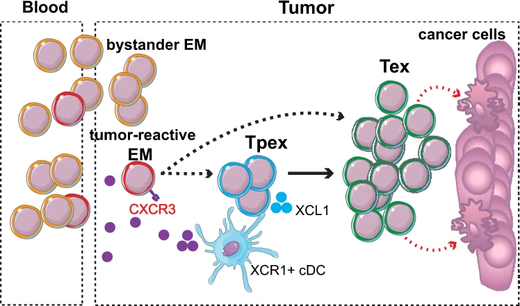

In this tutorial, we will present how to use ProjecTILs to detect Tpex in public datasets that were not detecting them. This CD8 human TILs reference was built using [Nick Borcherding collection](https://github.com/ncborcherding/utility) of single-cell datasets from tumor-patients. The map consists of 11,021 high-quality single-cell transcriptomes from 20 samples covering 7 tumor types.

The process and code to build the map can be found in [this Github repo](https://github.com/carmonalab/human_TIL_atlas).

Briefly, this reference was built using curated CD8+ T cells from 20 tumor-infiltrating patients, and integrated using [semi-supervised STACAS](https://carmonalab.github.io/STACAS.demo/STACAS.demo.html#semi-supervised-integration). Unsupervised clustering was performed on the integrated samples. Clusters were manually annotated with respect to classical immunology markers, with a special interest in detecting Tpex. Clusters were later downsampled to have at most 2000 cells per cluster. In our experience, this optimized cluster balance improves projection, as reported [here](https://www.biorxiv.org/content/10.1101/2023.01.25.525533v1.full.pdf) and [here](https://www.biorxiv.org/content/10.1101/2022.10.06.511156v2.full.pdf). Finally, this map was converted as a [ProjecTILs](https://github.com/carmonalab/ProjecTILs) reference. Please note that, as this reference was constructed with tumor-infiltrating samples, it might not work perfectly when mapping other tissues, such as blood or draining lymph nodes (DLN).

<details> <summary style="display:list-item"> Why doing projection? </summary>

Projection allow to classify cells using a well curated `ProjecTILs` reference map.

-   This method has the benefit of using the same cell types across projects, which is especially beneficial when analyzing huge collections of datasets.

-   This reference is also a way to annotate datasets only by stable cell types, and not transient cell states, like cell cycle or activation.

-   Results will be comparable across conditions, as there is little manual tuning. For instance, there is no need for steps which can have a high impact, such as selection of highly variable genes.

-   Projection is robust to batch effects, like single-cell technologies or sequencing depth (for more information, please read ProjecTILs paper - [Andreatta et al. 2021](https://www.nature.com/articles/s41467-021-23324-4)).

</details>

<details> <summary style="display:list-item"> What happens if some cells are not covered by the reference </summary>

If some cells are not covered by the reference, they automatically get filtered-out (eg. CD4 T cells if the reference is CD8 T cells).

By default, both `Run.ProjecTILs()` and `ProjecTILs.classifier()` have the parameter `filter.cells` set as `TRUE`. This means that cells out of reference will be filtered-out using the built-in [`scGate`](https://github.com/carmonalab/scGate) model. This model is stored in the slot misc of the reference [`Seurat`](https://github.com/satijalab/seurat) object: `ref@misc$scGate`. You can custom this filtering by amending this slot using [`scGate`](https://github.com/carmonalab/scGate) grammar.

</details>

</details>

```{r, include=FALSE, fig.width=16, fig.height=12, warning=FALSE, message=FALSE}
renv::restore()
library(Seurat)
library(tidyverse)
library(scGate)
library(STACAS)
library(data.table)
library(GEOquery)
library(patchwork)
library(ProjecTILs)
library(gridExtra)
library(SignatuR)
library(ggrepel)
library(scales)
library(UCell)
library(pheatmap)
library(EnhancedVolcano)
library(plotly)
#options(future.globals.maxSize= 5000*1024^2)
```

# Human CD8 TIL reference

First, let's have a look at the reference map.

```{r, message = F, warning=FALSE}
# Load the reference
options(timeout = max(900, getOption("timeout")))
#download.file("https://figshare.com/ndownloader/files/38921366", destfile = "CD8T_human_ref_v1.rds")
ref.cd8 <- load.reference.map("CD8T_human_ref_v1.rds")

# Setup colors
mycols <- ref.cd8@misc$atlas.palette

# Compute DEGs
DefaultAssay(ref.cd8) <- "RNA"
ref.cd8 <- NormalizeData(ref.cd8)
markers <- FindAllMarkers(object = ref.cd8, only.pos = TRUE, assay = "RNA")

# Remove TCR genes
tcr.genes <- SignatuR::GetSignature(SignatuR$Hs$Compartments$TCR)
markers <- markers %>% filter(!gene %in% unname(tcr.genes))
markers %>% group_by(cluster) %>% top_n(n = 3, wt = avg_log2FC) -> top3

# DimPlot
DimPlot(ref.cd8,  group.by = 'functional.cluster', label = T, repel = T, cols = mycols) + theme(aspect.ratio = 1)
```

Here are the different T cell subsets defined in the map:

-   **CD8.NaiveLike:** Antigen-naive T cells

-   **CD8.CM:** Central Memory T cells

-   **CD8.EM:** Effector Memory

-   **CD8.TEMRA:** Effector Memory cells re-expressing CD45RA. Sometimes called Short Lived Effectors (SLEC), or Cytotoxic effectors

-   **CD8.TPEX:** Progenitors exhausted T cells

-   **CD8.TEX:** Exhausted T cells

-   **CD8.MAIT:** MAIT cells, innate-like T cells defined by their semi-invariant αβ T cell receptor (TCR).

Let's check Differentially Expressed Genes (DEGs) between each cluster, to confirm cluster marker genes.

```{r, message = F, warning=FALSE, fig.height=10, fig.width=7}
# Plot heatmap
VlnPlot(ref.cd8, assay = "RNA", features  = top3$gene, cols = mycols, stack = T, flip = T, fill.by = "ident") + NoLegend()
```

# Progenitors exhauted (Tpex)

Pioneering work in the murine lymphocytic choriomeningitis virus (LCMV) model has mapped the molecular and phenotypic profiles of CD8+ T cells, revealing progenitors of exhausted T cells (TPEX), defined by the expression of transcription factors, TOX and TCF1. These cells which arise in the acute-phase of infection and sustain terminally exhausted subsets over the long-term. As they are thought to renew the pool of terminally exhausted cells, an increasing number of reports show that this population is of primary importance for cancer immunotherapy. ([Utzschneider](https://www.nature.com/articles/s41590-020-0760-z#auth-Daniel_T_-Utzschneider)[et al.](https://www.nature.com/articles/s41590-020-0760-z), [Siddiqui et al.](https://pubmed.ncbi.nlm.nih.gov/30635237/)).

Here are some marker genes to help identifying them:

[Positive markers:]{.underline} TCF7, CD200, CRTAM, GNG4, TOX, LEF1, CCR7, CXCL13, XCL1, XCL2

[Negative markers:]{.underline} GZMB, NKG7, PRF1, HAVCR2, CCL5, GZMA



Tumor T cell differentiation model, going through a intermediate state of progenitor exhausted (Tpex). Figure from [Andreatta et al. 2021](https://www.nature.com/articles/s41467-021-23324-4/figures/9).

Tpex importance is of growing interest, but except a few studies ([Oliveira et al.](https://www.nature.com/articles/s41586-021-03704-y), [Magen et al.](https://www.biorxiv.org/content/10.1101/2022.06.22.497216v1.full), [Zheng et al.](https://www.science.org/doi/abs/10.1126/science.abe6474)), this subset has been harder to detect in human. Having a human CD8 reference with clearly annotated Tpex solves this issue.

# Detecting Tpex in [Gueguen et al. 2021](https://www.science.org/doi/10.1126/sciimmunol.abd5778)

## Setup data

```{r, message=F, warning=F}
#download.file("https://figshare.com/ndownloader/files/39082049", destfile = "gueguen.cd3.Rds")
gueguen.cd3 <- readRDS("gueguen.cd3.Rds")
gueguen.cd3$seurat_clusters <- Idents(gueguen.cd3)
```

## Projection

Thanks to automatic scGate filtering, only the CD8 clusters (upper part of the UMAP) were mapped.

```{r, message=F, warning=F}
# Projection
DefaultAssay(gueguen.cd3) <- "RNA"
gueguen.cd3 <- ProjecTILs.classifier(gueguen.cd3, ref = ref.cd8, filter.cells = T, split.by = 'orig.ident', ncores = 6)
table(gueguen.cd3$functional.cluster)
DimPlot(gueguen.cd3, order = T,  label = T, repel = T) 
DimPlot(gueguen.cd3, group.by = 'functional.cluster', order = T, cols = mycols, label = T, repel = T)
```

```{r, fig.height=8, fig.width=15}
# Radar plots
p <- plot.states.radar(ref.cd8, query = gueguen.cd3, min.cells = 10, genes4radar = c('LEF1', "TCF7", "CCR7", "GZMK", "FGFBP2",'FCGR3A','ZNF683','ITGAE', "CRTAM", "CD200",'GNG4', "HAVCR2", "TOX", "ENTPD1", 'TYROBP','KIR2DL1'), return = T) 
wrap_plots(p) + theme_bw()
```

We can see that the previously homogeneous cluster CD8-LAYN seems to be in fact composed of two subsets: CD8.TEX and CD8.TPEX.

<details> <summary style="display:list-item"> How to assess quality/robustness of mapping </summary>

It can be hard to make the call between cells modified, and cells plainly wrongly mapped. We usually recommend to assess mapping consistency by checking consistency among top markers. If the query seems quite different from the reference, we recommend to understand DEGs between the reference and the query, for each cell type of interest.

</details>

# Detecting Tpex in [Yost et al. 2019](https://www.nature.com/articles/s41591-019-0522-3)

## Setup data

```{r}
# Load data
#download.file("https://figshare.com/ndownloader/files/39109277", destfile = "Yost.cd3.Rds")
Yost.cd3 <- readRDS("Yost.cd3.Rds")

# Normalize data
Yost.cd3 <- NormalizeData(Yost.cd3)
Yost.cd3 <- ScaleData(Yost.cd3)

# DimPlots
DimPlot(Yost.cd3, reduction = 'umap', group.by = 'cluster', label = T)
DimPlot(Yost.cd3, reduction = 'umap', group.by = 'patient', label = T, repel = T)
```

Now we can have a look at the original study annotation, including clusters. We can see that activation cluster (CD8_act) is patient specific, as it seems driven mainly by patient **su008** after receiving immunotherapy treatment.

## Projection

As this dataset is a mix between CD4 and CD8 T cells, we will keep the parameter `filter.cells` as TRUE to keep only CD8+ T cells.

```{r, message=F, warning=F}
DefaultAssay(Yost.cd3) <- "RNA"
Yost.cd3 <- ProjecTILs.classifier(Yost.cd3, ref = ref.cd8, filter.cells = T, split.by = 'patient', ncores = 6)
table(Yost.cd3$functional.cluster)

DimPlot(Yost.cd3, group.by = 'functional.cluster', order = T, cols = mycols, label = T, repel = T)
```

We indeed detect TPEX, next to TEX clusters, which make sense. Let's check globally how the expression profiles look.

```{r, fig.height=8, fig.width=15}
# Radar plots
p <- plot.states.radar(ref.cd8, query = Yost.cd3, min.cells = 10, genes4radar = c('LEF1', "TCF7", "CCR7", "GZMK", "FGFBP2",'FCGR3A','ZNF683','ITGAE', "CRTAM", "CD200",'GNG4', "HAVCR2", "TOX", "ENTPD1", 'TYROBP','KIR2DL1'), return = T) 
wrap_plots(p) + theme_bw()
```

We can see that in the Yost et al., CD8.TPEX can be found with profiles matching the reference, including in the CD8_act cluster.

## Subset example : **CD8_act** cluster

This cluster is composed of cells driven by their activation signal.

```{r, fig.width=15, fig.height=5}
Yost.cd3.sub <- subset(Yost.cd3, subset = cluster == "CD8_act")
DimPlot(Yost.cd3.sub, group.by = "cluster", repel = T, label = T) + DimPlot(Yost.cd3.sub, group.by = "functional.cluster", cols = mycols, repel = T, label = T)
```

```{r fig.width=10, fig.height=4}
DefaultAssay(Yost.cd3.sub) <- 'RNA'
FeaturePlot(Yost.cd3.sub, features = c('IL7R','FGFBP2','GZMK'), ncol = 3, pt.size = 0.5, order = T, cols = pals::coolwarm()) & NoLegend()
```

We see that in original reduced space, within the activated cluster, we recover cell types from our CD8 reference, including CM, TEMRA and EM clusters (respectively high for IL7R, FGFBP2 and GZMK). If you are interested in recovering cell types hidden by transient cell states, you can read more in the [corresponding tutorial](https://carmonalab.github.io/human_CD8_TIL_CaseStudies/Transient_gene_programs.html).
