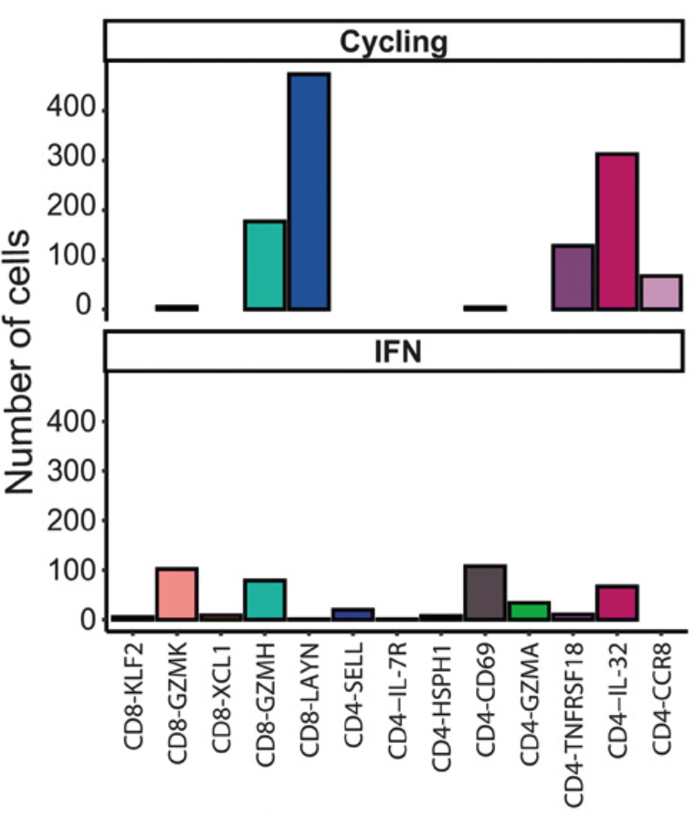

```{r, include=FALSE, warning=FALSE, message=FALSE}
renv::restore()
library(Seurat)
library(tidyverse)
library(scGate)
library(STACAS)
library(data.table)
library(GEOquery)
library(patchwork)
library(ProjecTILs)
library(gridExtra)
library(ggrepel)
library(scales)
library(paletteer)
library(UCell)
library(pheatmap)
library(plotly)
library(cowplot)
library(UpSetR)
library(grid)
#options(future.globals.maxSize= 5000*1024^2)
```

# Background

Cells responding to external cues can transiently activate gene programs, or groups of genes that are collectively involved in specific gene processes, such as cell division, or response to interferons. In scRNA-seq data, transcriptional variance can be largely explained by these transient gene expression programs masking differences between different cell types, and leading to the clustering of cells of different types.

Some typical gene programs observed in T cell scRNA-seq data:

-   **Cell cycle** (eg. MCM5, TOP2A)

-   **Interferon (IFN) response** (eg. MX1, ISG15)

-   **Heat shock protein (HSP) response** (eg. HSPA1, HSPA2)

-   **TCR Activation** (eg. JUN, FOS, NR4A1)

-   **Tissue-residency** a program associated to homing and/or retention of T cells in non-lymphoid tissues (eg. ZNF683, ITGAE)


Here we will show to use reference-based projection to classify cells into robust subtypes, irrespective of the activation of transient gene programs, but still recover this important information to more granularly define cell states.

In this example we will use data from [Gueguen et al. 2021](https://www.science.org/doi/10.1126/sciimmunol.abd5778).


# Data setup

## Loading the reference map

First, let's download and load the CD8 TIL reference map Seurat object

```{r, message=FALSE, warning=F}
# Load the reference
options(timeout = max(900, getOption("timeout")))
download.file("https://figshare.com/ndownloader/files/38921366", destfile = "CD8T_human_ref_v1.rds")
ref.cd8 <- load.reference.map("CD8T_human_ref_v1.rds")

# Setup colors
mycols <- ref.cd8@misc$atlas.palette

# Plotting
DimPlot(ref.cd8,  group.by = 'functional.cluster', label = T, repel = T, cols = mycols) + theme(aspect.ratio = 1)
```

We can verify the reference map only contains "stable" or "basal" cell types (cells strongly expressing transient gene programs, such as cell division, IFN-response, and HSP-response were removed from the reference by design).

## Load query data

Download and load Seurat object containing the pre-annotated Gueguen dataset.
In this example, the original author annotations are available in the `seurat_clusters` metadata column

```{r, message=F, warning=F}
download.file("https://figshare.com/ndownloader/files/39082049", destfile = "gueguen.cd3.Rds")
gueguen.cd3 <- readRDS("gueguen.cd3.Rds")
DefaultAssay(gueguen.cd3) <- "RNA"
gueguen.cd3$seurat_clusters <- Idents(gueguen.cd3)

# DimPlot
DimPlot(gueguen.cd3, order = T,  label = T, repel = T) 
```

# ProjecTILs reference-based classification 

Next we will run [ProjecTILs](https://github.com/carmonalab/ProjecTILs) `ProjecTILs.classifier` function. This running mode will add the predicted celltype labels as metadata (i.e. `functional.cluster`), while keeping intact the original low dimensional embeddings.

Here we will run the prediction separately for each patient/sample contained in the dataset. To this end, we include the parameter `split.by` indicating the metadata column containing the sample information (in this example `orig.ident`).


```{r, message=F, warning=F, fig.height=5, fig.width=8}
# Projection
gueguen.cd3 <- ProjecTILs.classifier(gueguen.cd3, ref = ref.cd8, filter.cells = T, split.by = 'orig.ident', ncores = 6)

# Plotting
DimPlot(gueguen.cd3, group.by = 'functional.cluster', order = T, cols = mycols, label = T, repel = T)

table(gueguen.cd3$functional.cluster)
```

# Augmenting cell states resolution by quantifying activation of gene programs

To further sub-classify T cell reference subtypes according to the activation of gene programs, we will use [UCell](https://github.com/carmonalab/UCell). In this example we will also use [SignatuR](https://github.com/carmonalab/SignatuR) that stores useful gene signatures (e.g cell cycle).

```{r warning=F, message=F, eval=T}
library(SignatuR)
signatures <- GetSignature(SignatuR$Hs)
signatures <- signatures[c("cellCycle.G1S","cellCycle.G2M")]

# for IFN and tissue-residecy we will simply define them manually
signatures[["IFN"]] <- c("ISG15","IFI6","IFI44L","MX1")
signatures[["Tissue_Resident"]] <-  c("ITGAE")
```

Now let's compute the gene signature scores using `UCell`

```{r, eval=T}
gueguen.cd3 <- AddModuleScore_UCell(gueguen.cd3, features = signatures, ncores = 8,
                       assay = "RNA")
```

We can visualize these scores on the UMAP, and verify their agreement with the original author annotations (CD4/8-MCM5, CD4/8-TOP2A cell clusters with high cycling score, and CD4/8-ISG15 cluster with high IFN response score).

```{r, fig.height=15, fig.width=16}
FeaturePlot(gueguen.cd3, features = paste0(names(signatures), "_UCell"),
    order = T, pt.size = 0.3) & scale_color_paletteer_c("pals::coolwarm") 
```


We can now classify each cell into low/high for each gene program, according to their signature scores.


<details>

<summary style="display:list-item">

Signatures scores distributions

</summary>

We can explore signatures scores distributions and set a threshold to classify cells into negative/positive for each gene program. Here we will use a global threshold of 0.2.

```{r, message=FALSE, warning=F, fig.width=10, fig.height=10}
qplot(gueguen.cd3$cellCycle.G1S_UCell, main = "G1S-Cycling") +
    qplot(gueguen.cd3$cellCycle.G2M_UCell, main = "G2M-Cycling") + qplot(gueguen.cd3$IFN_UCell, main = "IFN") + qplot(gueguen.cd3$Tissue_Resident_UCell, main = "Tissue Resident") & theme_bw()
```

</details>

Example with the G1S-cycling signature:

```{r, fig.width=12, fig.height=5}

cycling.G1S.high <- subset(gueguen.cd3, subset = cellCycle.G1S_UCell > 0.2)
cycling.G1S.low <- subset(gueguen.cd3, subset = cellCycle.G1S_UCell <= 0.2)


cycling.G1S.list <- list(cycling.G1S.low,cycling.G1S.high)
names(cycling.G1S.list) <- c("cycling.G1S.low","cycling.G1S.high")
```

Visualize using ProjecTILs `plot.states.radar` function

```{r, fig.height=8, fig.width=15}

plot.states.radar(ref = ref.cd8, query = cycling.G1S.list, labels.col = 'functional.cluster', min.cells = 5, genes4radar = c("SELL","LEF1","TCF7","CCR7","KLF2","GZMK", "GZMA", "FCGR3A","FGFBP2","XCL1","XCL2", "KLRB1",'MCM5',"MCM3","TOP2A")) 
```

Here Cycling-G1S high and Cycling-G1S low cells display gene expression profiles in terms of marker genes, but differ in their expression of cell cycle genes, such as MCM5, MCM3 and TOP2A.

Now we can do this for the 4 signatures that we selected at the beginning.

```{r, include=FALSE}
# Show as discrete categories instead (by defining a threshold on the UCell scores)
# Plotting
# Per functional.cluster
pll <- list()
data.mean.table <- c()
for (x in names(signatures)){
  gueguen.cd3[[paste0(x, ".class")]] <- NA
  gueguen.cd3[[paste0(x, ".class")]][,1][which(gueguen.cd3[[paste0(x, "_UCell")]] > 0.2)] <- "Positive"
  gueguen.cd3[[paste0(x, ".class")]][,1][which(gueguen.cd3[[paste0(x, "_UCell")]] <= 0.2)] <- "Negative"
  data <- prop.table(table(gueguen.cd3[[paste0(x, ".class")]][,1], gueguen.cd3$functional.cluster), margin = 2)
  data <- as.data.frame(data)
  
colnames(data) <- c("Class","functional.cluster","Frequency")
  levels.order <- data |> group_by(functional.cluster) |> filter(Class == "Negative") |> arrange(-Frequency) |> select(functional.cluster)
  data$functional.cluster <- factor(x = data$functional.cluster, levels = levels.order$functional.cluster)
pll[[x]] <- plot(ggplot(data, aes_string(x = "functional.cluster", y = "Frequency",
        fill = "Class")) + geom_bar(position="fill", stat="identity") + scale_fill_manual(values = c("grey","firebrick2")) + theme_cowplot() + RotatedAxis() + ggtitle(paste("Frequencies for signature", x)))
}
```

```{r, fig.width=12, fig.height=8}
wrap_plots(pll, guides = "collect")
```

As previously shown, CD8.TEX and CD8.TPEX populations contain the highest frequency of proliferating, tissue-resident and IFN-responding cells.

# Bonus track

## Upset plot to check program co-occurences

Let's focus on the CD8.TEX population, and see how the different gene programs relate using a UpSet plot, using [UpSetR](https://github.com/hms-dbmi/UpSetR) package.

```{r}
gueguen.cd3.TEX <- subset(gueguen.cd3, subset = functional.cluster == "CD8.TEX")
listInput <- list(IFN = which(gueguen.cd3.TEX$IFN.class == "Positive"), 
                  Cycling.G2M = which(gueguen.cd3.TEX$cellCycle.G2M.class == "Positive"), 
                  Cycling.G1S = which(gueguen.cd3.TEX$cellCycle.G1S.class == "Positive"),
                  Tissue_resident = which(gueguen.cd3.TEX$Tissue_Resident.class == "Positive"))


upset(fromList(listInput), order.by = "freq") 
grid.text("CD8.TEX gene programs overlap",x = 0.65, y=0.95, gp=gpar(fontsize=12))
```

We can see that roughly one third of CD8.TEX with high tissue-residency program are also high for IFN-response program.

## Comparison with the original annotation

In the original study, cycling cells are defined as "CD8.LAYN" and "CD8.GZMH"

{width="500"}

Now let's compare this with ProjecTILs classifications. First, let's subset cells in the 2 cycling clusters CD4/8-TOP2A and CD4/8-MCM5.

```{r}
gueguen.cycling <- subset(gueguen.cd3, subset = seurat_clusters %in% c('CD4/8-TOP2A', "CD4/8-MCM5"))

# Dimplot
DimPlot(gueguen.cycling, group.by = 'functional.cluster', label = T, repel = T, cols = mycols)
```

We can have a look at clusters proportions in the original cycling clusters.
It seems that there is more heterogeneity among cycling cells than previously observed, including Central Memory and Effector Memory T cells.

```{r}
plot.statepred.composition(ref.cd8, gueguen.cycling, metric = "Percent") +
    ggtitle("Cycling cells") + ylim(0, 75) + theme_bw() + RotatedAxis()
```


Let's check radar plots to confirm identities, where we included some markers genes for cell cycle: TOP2A, MCM5 and MCM3.

```{r, fig.height=8, fig.width=15}
plot.states.radar(ref = ref.cd8, query = gueguen.cycling, labels.col = 'functional.cluster', min.cells = 5, genes4radar = c("SELL","LEF1","TCF7","CCR7","KLF2","GZMK", "GZMA", "FCGR3A","FGFBP2","XCL1","KLRB1",'MCM5',"MCM3","TOP2A","PDCD1","TOX","HAVCR2"))
```

The marker gene profiles support a correct classification. 

<details>

<summary style="display:list-item">

Session Info

</summary>

```{r}
sessionInfo()
```

</details>
